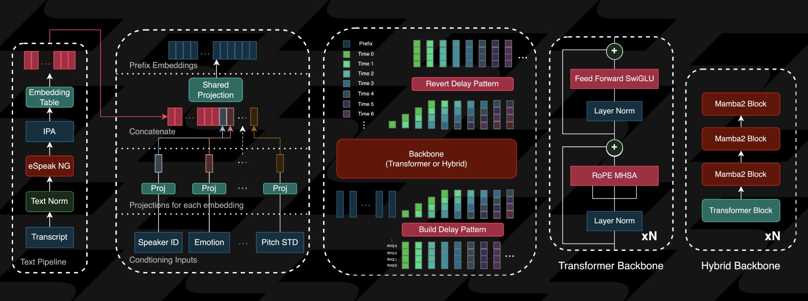

# ZonosTTS Architecture

## Overview

ZonosTTS (Zonos-v0.1) is a high-quality text-to-speech synthesis system trained on more than 200,000 hours of multilingual speech data. The architecture follows a modernized approach to TTS that focuses on expressiveness, quality, and versatility.

## System Architecture

### High-Level Architecture

The system follows a two-stage architecture:
1. **Text Processing Stage**: Normalizes and phonemizes text via eSpeak
2. **Audio Generation Stage**: Predicts discrete audio codes through a transformer or hybrid backbone

<div align="center">

</div>

### Core Components

#### Text Processing
- **Text Normalization**: Converts raw text input into a standardized format
- **Phonemization**: Uses eSpeak to convert text to phonetic representation
- **Tokenization**: Processes phonetic data into tokens for the model

#### Conditioning System
The model accepts various conditioning inputs that control different aspects of the generated speech:

| Conditioning Type | Description | Models |
|-------------------|-------------|--------|
| espeak | Text pre-processing pipeline | Transformer & Hybrid |
| speaker | Speaker voice characteristics | Transformer & Hybrid |
| emotion | 8D vector for emotional control | Transformer & Hybrid |
| fmax | Maximum frequency specification | Transformer & Hybrid |
| pitch_std | Pitch variation control | Transformer & Hybrid |
| speaking_rate | Phonemes per second rate | Transformer & Hybrid |
| language_id | Language identifier | Transformer & Hybrid |
| vqscore_8 | Speech quality estimation | Hybrid only |
| ctc_loss | Text-audio alignment quality | Hybrid only |
| dnsmos_ovrl | Mean Opinion Score | Hybrid only |
| speaker_noised | Speaker embedding denoising flag | Hybrid only |

#### Model Variants
1. **Transformer-based Model**
   - Pure transformer architecture
   - Lighter computational requirements
   - Core conditioning support

2. **Hybrid Model**
   - Enhanced architecture
   - Requires 3000-series or newer NVIDIA GPU
   - Additional conditioning options
   - Potentially higher quality output

#### Audio Pipeline
- **DAC Token Prediction**: Predicts discrete audio codes
- **Neural Codec**: Decodes discrete tokens back into continuous audio waveforms
- **Output**: 44kHz high-quality audio

## Code Structure

```
zonos/
├── autoencoder.py          # Neural codec implementation
├── backbone/               # Model architecture implementations
├── codebook_pattern.py     # Discrete token patterns
├── conditioning.py         # Conditioning system implementation
├── config.py               # Configuration parameters
├── model.py                # Main model implementation
├── sampling.py             # Generation and sampling utilities
├── speaker_cloning.py      # Speaker embedding extraction
└── utils.py                # Utility functions
```

## Integration Points

- **Python API**: Direct integration via Python code
- **Gradio Interface**: User-friendly web interface for interactive use
- **Docker**: Containerized deployment

## Technical Details

- **Input**: Text and optional reference audio
- **Output**: 44kHz audio waveform
- **Performance**: ~2x real-time factor on RTX 4090
- **Memory Requirements**: Minimum 6GB VRAM (GPU) or equivalent RAM (CPU)
- **Dependencies**: eSpeak-ng, PyTorch, torchaudio

## MicroSaaS Extension Architecture

The ZonosTTS framework can be extended into a complete voice cloning and redubbing microSaaS platform through the addition of several key components.

### Extended System Architecture

```
┌─ Phase 1: MVP ─────────────────────────────────────────────────────┐
│                                                                     │
│  • Whisper.wasm for transcription                                   │
│  • Basic speaker segmentation (non-overlapping)                     │
│  • ZonosTTS for voice cloning and synthesis                         │
│  • Simple audio export                                              │
│                                                                     │
└─────────────────────────────────────────────────────────────────────┘
          │
          ▼
┌─ Phase 2: Enhanced ───────────────────────────────────────────────┐
│                                                                     │
│  • Add server-side Pyannote for better diarization                  │
│  • Implement basic overlap handling                                 │
│  • Add translation capabilities                                     │
│  • Improve synchronization                                          │
│                                                                     │
└─────────────────────────────────────────────────────────────────────┘
          │
          ▼
┌─ Phase 3: Advanced ───────────────────────────────────────────────┐
│                                                                     │
│  • Full speaker overlap detection and handling                      │
│  • Emotion transfer from original to synthesized speech             │
│  • Advanced audio editing capabilities                              │
│  • API access for third-party integration                           │
│                                                                     │
└─────────────────────────────────────────────────────────────────────┘
```

### CPU-Focused Architecture

For voiceover workflows without avatar rendering, a CPU-only pipeline offers cost-effective processing:

```
┌─ Client (CPU-Only) ─────────────────────────────────────────────────────┐
│                                                                          │
│  ┌──────────────┐   ┌───────────────┐   ┌────────────────┐              │
│  │ Audio/Video  │──▶│ Whisper.wasm  │──▶│ Transcript     │              │
│  │ Input        │   │ Transcription │   │ Processing     │              │
│  └──────────────┘   └───────────────┘   └────────────────┘              │
│                                                 │                        │
│  ┌──────────────┐   ┌───────────────┐   ┌──────▼─────────┐              │
│  │ Final Audio  │◀──│ ZonosTTS      │◀──│ Voice Profile  │              │
│  │ Output       │   │ (CPU version) │   │ Management     │              │
│  └──────────────┘   └───────────────┘   └────────────────┘              │
│                                                                          │
└──────────────────────────────────────────────────────────────────────────┘
```

### Modular Pipeline Components

1. **Transcription Module**
   - Whisper.wasm for browser-based speech recognition
   - Timestamp generation for synchronization
   - Language detection and handling
   
2. **Diarization Module**
   - Speaker identification and segmentation
   - Voice profile extraction
   - Sequential processing after transcription
   
3. **Voice Synthesis Module**
   - ZonosTTS for voice cloning
   - Emotion and cadence matching
   - Language-specific synthesis optimization
   
4. **Synchronization Module**
   - Alignment of synthesized speech with original timing
   - Handling of pauses and natural speech patterns
   - Optional integration with video content

## Voice Profile Management System

### Architecture Overview

The Voice Profile Management System is a comprehensive framework for storing, managing, and utilizing voice profiles in ZonosTTS, providing an alternative to ad-hoc voice cloning with preset voices and fine-tuning capabilities.

```
┌─ Voice Profile Management System ────────────────────────────────────┐
│                                                                      │
│  ┌──────────────────┐   ┌────────────────┐   ┌───────────────────┐  │
│  │ Profile Creation │──▶│ Profile        │──▶│ Profile Fine-     │  │
│  │ & Import         │   │ Storage        │   │ Tuning Interface  │  │
│  └──────────────────┘   └────────────────┘   └───────────────────┘  │
│           │                      │                     │             │
│           ▼                      ▼                     ▼             │
│  ┌──────────────────┐   ┌────────────────┐   ┌───────────────────┐  │
│  │ Reference Audio  │   │ Voice Library  │   │ Parameter         │  │
│  │ Management       │   │ (Kokoro etc.)  │   │ Adjustment        │  │
│  └──────────────────┘   └────────────────┘   └───────────────────┘  │
│                                │                                     │
│                                ▼                                     │
│  ┌──────────────────┐   ┌────────────────┐   ┌───────────────────┐  │
│  │ Profile Export   │◀──│ TTS System     │◀──│ Quality Metrics   │  │
│  │ & Sharing        │   │ Integration    │   │ & Analysis        │  │
│  └──────────────────┘   └────────────────┘   └───────────────────┘  │
│                                                                      │
└──────────────────────────────────────────────────────────────────────┘
```

### Core Components

#### 1. VoiceProfileManager

- Central class managing all profile operations
- Handles profile storage, retrieval, and caching
- Manages tensor serialization and deserialization
- Provides interface for profile parameter adjustments

#### 2. Voice Profile Storage Format

JSON-based format for storing voice profiles:

```json
{
  "profile_id": "unique-identifier",
  "name": "Voice Profile Name",
  "description": "Optional description",
  "created_at": "2025-03-12T15:01:26-04:00",
  "updated_at": "2025-03-12T15:01:26-04:00",
  "source": {
    "type": "sample",  // "sample", "kokoro", "custom"
    "path": "path/to/audio.wav"
  },
  "speaker_embedding": {
    "format": "tensor",
    "data": "base64-encoded-tensor-data"
  },
  "parameters": {
    "fmax": 24000,
    "pitch_std": 45.0,
    "speaking_rate": 15.0,
    "dnsmos_ovrl": 4.0,
    "emotions": [1.0, 0.05, 0.05, 0.05, 0.05, 0.05, 0.1, 0.2],
    "vqscore": 0.78
  },
  "tags": ["professional", "female", "english"],
  "samples": ["path/to/sample1.wav", "path/to/sample2.wav"]
}
```

#### 3. Directory Structure

```
zonos/
├── voices/
│   ├── profiles/        # JSON profile definitions
│   │   ├── profile1.json
│   │   └── profile2.json
│   ├── samples/         # Sample audio organized by profile
│   │   ├── profile1/
│   │   │   └── samples...
│   │   └── profile2/
│   │       └── samples...
│   └── kokoro/          # Preset voice samples
│       ├── female1_en.wav
│       ├── male1_en.wav
│       └── ...
└── ...
```

#### 4. Gradio Integration

- Profile management tab in UI
- Voice selection dropdown for Kokoro voices
- Parameter adjustment sliders
- Profile creation, editing, and deletion functions
- Sample management interface

### Technical Integration Strategy

- **Browser-First Approach**: Maximize client-side processing for scalability
- **Modular Components**: Allow selective server offloading when necessary
- **Progressive Enhancement**: Provide basic functionality with graceful enhancement
- **Asynchronous Processing**: Enable background processing for longer content

## Speech Editor Integration (wscribe-editor)

### Architecture Overview

The integration of wscribe-editor with ZonosTTS creates a complete end-to-end TTS system with powerful editing capabilities. This allows users to generate audio with ZonosTTS and then immediately edit and fine-tune the output at the phoneme level while preserving natural prosody.

```
┌─ ZonosTTS Speech Editor Workflow ────────────────────────────────────┐
│                                                                       │
│  ┌──────────────┐   ┌───────────────┐   ┌────────────────────────┐   │
│  │ Text Input   │──▶│ TTS           │──▶│ Phoneme-Level          │   │
│  │ & Parameters │   │ Generation    │   │ Timestamping           │   │
│  └──────────────┘   └───────────────┘   └────────────────────────┘   │
│         ▲                                          │                  │
│         │                                          ▼                  │
│  ┌──────────────┐   ┌───────────────┐   ┌────────────────────────┐   │
│  │ Voice        │◀──│ Segment       │◀──│ SRT/VTT/JSON          │   │
│  │ Profiles     │   │ Re-synthesis  │   │ Generation             │   │
│  └──────────────┘   └───────────────┘   └────────────────────────┘   │
│         ▲                   ▲                      │                  │
│         └───────────────────┘                      ▼                  │
│                                       ┌────────────────────────┐   │
│                                       │ wscribe-editor         │   │
│  ┌──────────────┐                    │ ┌──────────────────┐   │   │
│  │ Final Audio  │◀───────────────────┤ │ Phoneme Editor   │   │   │
│  │ Export       │                    │ └──────────────────┘   │   │
│  └──────────────┘                    └────────────────────────┘   │
│                                                                       │
└───────────────────────────────────────────────────────────────────────┘
```

### Core Components

#### 1. Phoneme-Level Timestamp Generation

The TTS system will be enhanced to generate not just audio but also precise phoneme-level timestamps that map each sound to its corresponding text position. This requires:

- Phoneme extraction from the text normalization pipeline
- Alignment tracking during the audio generation process
- Metadata packaging into standard formats (SRT, VTT, JSON)

#### 2. Segment Identification and Processing

The system identifies natural breakpoints for editing, which may include:

- Sentence boundaries for major edits
- Phrase and clause boundaries for medium-scale edits
- Word and phoneme boundaries for fine-grained adjustments

This segmentation allows for targeted re-synthesis of only the modified portions while preserving the natural flow of speech.

#### 3. wscribe-editor Adaptation

The wscribe-editor will be adapted and enhanced to support:

- Direct integration with ZonosTTS's output formats
- Visualization of phoneme-level timing and confidence
- Interactive editing interface with real-time feedback
- Support for prosody markers and speech emphasis
- Multi-speaker document management

#### 4. Re-synthesis Pipeline

When edits are made, the system will:

1. Identify the minimal scope of text that needs re-synthesis
2. Maintain prosodic context from surrounding speech
3. Apply the same voice profile and parameters as the original
4. Regenerate only the modified segments
5. Seamlessly stitch the new audio with unchanged portions

#### 5. Integration with Voice Profile Management

The editor will connect directly to the Voice Profile Management System, allowing:

- Voice profile selection for specific segments
- Parameter adjustment within the editor interface
- Creation of new profiles from particularly well-rendered segments
- A/B testing of different voice settings

### Technical Implementation Strategy

- **Web-Based Approach**: Fully browser-compatible solution
- **Modular Architecture**: Clean interface boundaries between components
- **Minimal Re-synthesis**: Only regenerate what has changed
- **Context Preservation**: Maintain prosody across edit boundaries
- **Progressive Enhancement**: Basic functionality with advanced options

### Data Flow

1. **Input Phase**: Text and voice parameters → ZonosTTS
2. **Generation Phase**: Text → Phonemes → Audio with timestamps
3. **Export Phase**: Audio + Metadata → SRT/VTT/JSON
4. **Editing Phase**: wscribe-editor interface for adjustments
5. **Re-synthesis Phase**: Modified text → Targeted audio regeneration
6. **Output Phase**: Stitched audio and updated metadata files

## Future Architecture Considerations

- Potential optimization for CPU-only environments
- Further model size reduction techniques
- Enhanced multilingual support
- Real-time streaming capability
- Integration with translation services
- Support for emotion transfer and preservation

---

(C)2025 Robin L. M. Cheung, MBA
